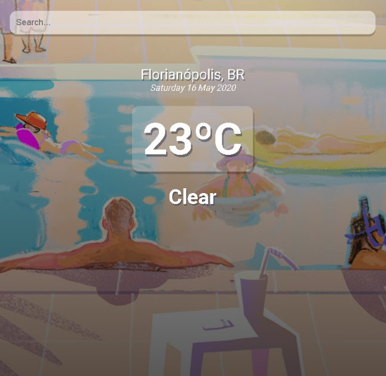
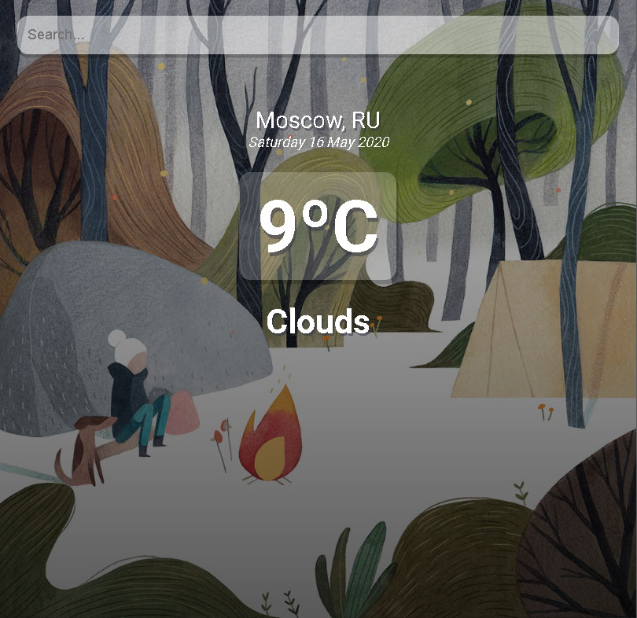

## Prática com ReactJS e consumo de API

Solução rápida para buscar temperatura, testei em diversas cidades além de capitais e funcionou tudo perfeitamente. 
Seguem abaixo algumas imagens do funcionamento, e de alguns detalhes estéticos, a imagem de fundo muda de acordo com a temperatura. 

Quando acima de 16ºC

    

E quando a temperatura for mais baixa

    

Pretendo fazer um uptade em breve, e exercitar essa aplicação com react native.
